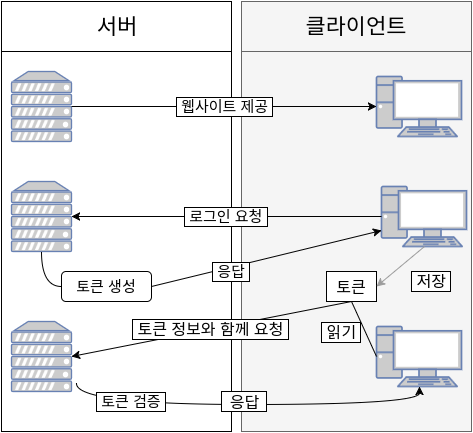

## 1. 서버 기반 인증 vs 토큰 기반 인증

특정 사용자가 서버에 접근을 했을 때, 이 사용자가 인증된 사용자인지 구분하기 위해서는 여러 방법을 사용할 수 있는데요. 대표적인 방법으로는

- 서버 기반 인증
- 토큰 기반 인증

위 2가지 방법으로 나눌 수 있습니다. 위 방법들은 각각의 장, 단점이 존재하기 때문에 상황에 맞게 적절한 방법을 선택해야합니다. 그 중 JWT는 '토큰 기반 인증'에 해당하는 방법입니다.

토큰을 사용한다는 것은 요청과 응답에 토큰을 함께 보내 이 사용자가 유효한 사용자인지를 검색하는 방법입니다. 이때, 보통 **Json Web Token(JWT)**를 사용해서 토큰을 전달합니다.



1. 클라이언트가 아이디와 비밀번호를 서버에게 전달하며 인증을 요청한다.
2. 서버는 아이디와 비밀번호를 통해 유효한 사용자인지 검증하고, 유효한 사용자인 경우 **토큰을 생성해서 응답**한다.
3. 클라이언트는 토큰을 저장해두었다가, **인증이 필요한 api에 요청할 때 토큰 정보와 함께 요청**한다.
4. 서버는 토큰이 유효한지 검증하고, 유효한 경우에는 응답을 해준다.


## 2. 토큰 사용 방식의 특징

### 2-1. 무상태성

사용자의 인증 정보가 담겨있는 토큰을 클라이언트에 저장하기 때문에 서버에서 별도의 저장소가 필요 없어, 완전한 **무상태(stateless)**를 가질 수 있습니다. 그리고 이로인해 서버를 확장할 때 용이합니다.

### 2-2. 확장성

토큰 기반 인증을 사용하는 다른 시스템에 접근이 가능합니다. (ex. Facebook 로그인, Google 로그인)

### 2-3. 무결성

HMAC(Hash-based Message Authentication) 기법이라고도 불리며, 발급 후의 토큰의 정보를 변경하는 행위가 불가능합니다. 즉, 토큰이 변조되면 바로 알아차릴 수 있습니다.

### 2-3. 보안성

클라이언트가 서버에 요청을 보낼 때, 쿠키를 전달하지 않기 때문에 쿠키의 취약점은 사라지집니다.


## 3. JWT?

이제 토큰 기반 인증에 대해 대충 알아보았으니, JWT가 무엇이고, 어떻게 구성이 되어있는지 알아보도록 하겠습니다. JWT는 아까 서술했듯이, **토큰 기반 인증 시스템의 대표적인 구현체**입니다. Java를 포함한 많은 프로그래밍 언어에서 이를 지원하며, 보통 회원 인증을 할 때에 사용됩니다.


JWT는 `.`을 기준으로 헤더(header) - 내용(payload) - 서명(signature)으로 이루어져있습니다. 

 

### 3-1. 헤더(header)

헤더는 토큰의 타입과 해싱 알고리즘을 지정하는 정보를 포함합니다.

- typ : 토큰의 타입을 지정합니다. `JWT`라는 문자열이 들어가게 됩니다.

- alg: 해상 알고리즘을 지정합니다.

  ```
  {
  	"typ": "JWT",
  	"alg": "HS256"
  }
  ```

​		위 예제를 해석하면, JWT 토큰으로 이루어져있고, 해당 토큰은 HS256으로 해상 알고리즘으로 사용되었다는 것을 알 수 있습니다.

 

### 3-2. 정보(payload)

토큰에 담을 정보가 들어갑니다. 정보의 한 덩어리를 클레임(claim)이라고 부르며, 클레임은 key-value의 한 쌍으로 이루어져있습니다. 클레임의 종류는 세 종류로 나눌 수 있습니다.

- 등록된(registered) 클레임
  - 토큰에 대한 정보를 담기 위한 클레임들이며, **이미 이름이 등록되어있는 클레임**
  - `iss` : 토큰 발급자(issuer)
  - `sub` : 토큰 제목(subject)
  - `aud` : 토큰 대상자(audience)
  - `exp` : 토큰의 만료시간(expiraton). 시간은 NumericDate 형식으로 되어있어야 하며,(예: 1480849147370) 항상 현재 시간보다 이후로 설정되어있어야한다.
  - `nbf` : Not Before 를 의미하며, 토큰의 활성 날짜와 비슷한 개념. NumericDate 형식으로 날짜를 지정하며, 이 날짜가 지나기 전까지는 토큰이 처리되지 않는다.
  - `iat` : 토큰이 발급된 시간 (issued at)
  - `jti` : JWT의 고유 식별자로서, 주로 일회용 토큰에 사용한다.
- 공개(public) 클레임
  - 말 그대로 공개된 클레임, 충돌을 방지할 수 있는 이름을 가져야하며, 보통 클레임 이름을 URI로 짓는다.
- 비공개(private) 클레임
  - 클라이언트 - 서버간에 통신을 위해 사용되는 클레임

→ 예제 Payload

```
{
		"iss": "ajufresh@gmail.com", // 등록된(registered) 클레임
    "iat": 1622370878, // 등록된(registered) 클레임
    "exp": 1622372678, // 등록된(registered) 클레임
    "https://shinsunyoung.com/jwt_claims/is_admin": true, // 공개(public) 클레임
    "email": "ajufresh@gmail.com", // 비공개(private) 클레임
    "hello": "안녕하세요!" // 비공개(private) 클레임
}
```


### 3- 3. 서명(signature)

해당 토큰이 조작되었거나 변경되지 않았음을 확인하는 용도로 사용하며, 헤더(header)의 인코딩 값과 정보(payload)의 인코딩값을 합친 후에 주어진 비밀키를 통해 해쉬값을 생성합니다.

```
HMACSHA256(
  base64UrlEncode(header) + "." +
  base64UrlEncode(payload),
  secret)
```


참고 페이지: https://shinsunyoung.tistory.com/category/Backend/SpringBoot